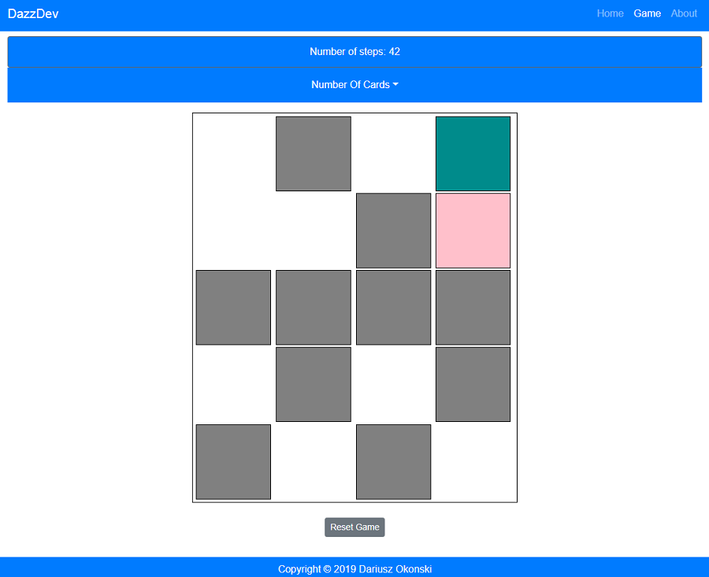

# Memory Game App in React

Memory Game is a create react app. It was created for desktop and mobile views. User can choose
between 8 to 20 colorful boxes. User have to guess all pairs. There is all number of steps count.

## Tools & Technology used

- Visual Studio Code
- React
- HTML
- CSS
- BootStrap
- UUID
- hooks (useState)
